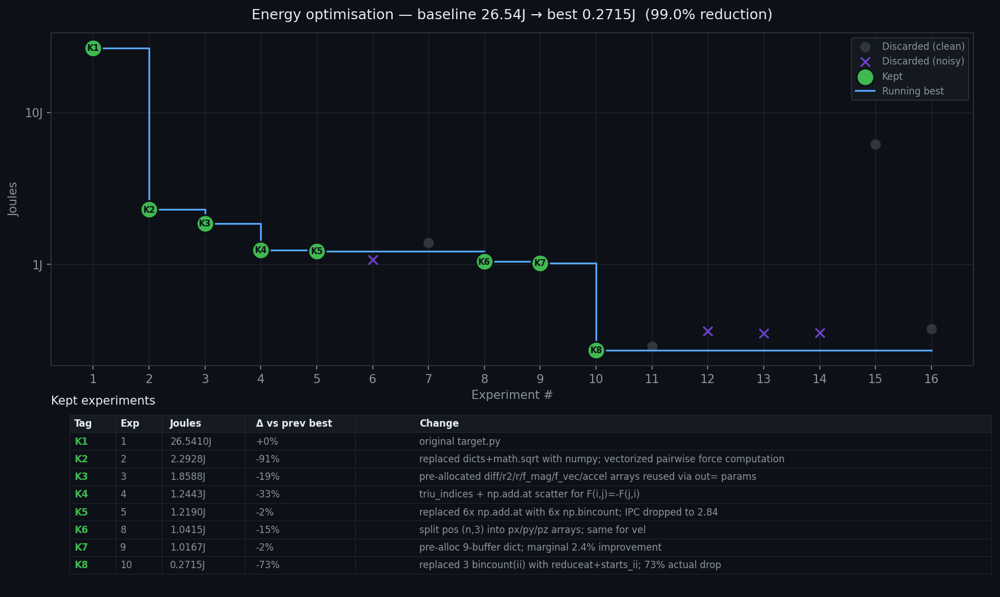

# empirical-autoresearch

An autonomous-AI **autoresearch loop** that improves a Python program against a **dashboard of measured signals**, not a single self-judged number. Each iteration reads real instrumentation, forms a causal hypothesis, makes a *falsifiable* quantitative prediction, changes the code, re-measures, and keeps or reverts based on whether the prediction held. Inspired by [Karpathy's autoresearch](https://github.com/karpathy/autoresearch) loop.

The loop is **metric-agnostic** — the optimisation target is just whatever the dashboard measures. This repo ships **energy consumption (joules)** as the headline example: the same machinery would work for latency, peak memory, accuracy, or cost-per-token by swapping the harness and the dashboard signals. What makes it distinctive is not the metric but the discipline: *measured* feedback closing the loop, and *falsifiable predictions* separating real understanding from plausible-sounding guesses.

The agent is not boxed into rewriting code by hand. When the same bottleneck survives several experiments, it **searches online** for known solutions and may **install third-party libraries** (JIT compilers like Numba or Taichi, etc.) when it predicts they will pay off — adding them to `pyproject.toml` as part of the experiment.

> **The energy example is Apple Silicon Macs only.** Its measurement harness reads energy from `powermetrics` (Apple Silicon power telemetry) and performance counters from Apple's `/usr/bin/time -l`, so the *energy* use case will not run on Intel Macs, Linux, or Windows. The loop pattern itself is platform-independent — only this instantiation is Mac-bound.

> ## ⚠ Safety note — read before running
>
> This loop lets an LLM agent **write and execute Python on your machine on every iteration**, and may propose adding packages to `pyproject.toml` and running `uv sync` to install them. That's by design — it's how the agent explores optimisations — but it has consequences:
>
> - Each iteration runs `subprocess.run([sys.executable, "target.py"])` with **your user privileges**. The agent's edits are confined to `target.py`, but `target.py` is then executed as you.
> - The loop requires a passwordless-sudo rule for `/usr/bin/powermetrics` (see Setup) and runs unattended with that scoped sudo rule active. Remove the rule when you're done with the project.
> - The agent may install third-party packages from PyPI. **Review each commit before continuing the loop.** Don't run with `--dangerously-skip-permissions`.
>
> Run this in a directory you trust, on a machine you can interrupt, and not on anything you'd call production.

## The idea

Computation is a physical process. Every instruction the CPU executes consumes joules. Standard autoresearch loops optimize on wall-clock time — a coarse proxy. This loop optimizes on **energy**, measured directly from the chip, with **first-principles hypotheses** about what is happening at the hardware level.

Each run of `measure.py` produces a **diagnostic dashboard** — 11 signals read directly from the hardware via `powermetrics` (Apple Silicon power telemetry) and `/usr/bin/time -l` (kernel performance counters):

| # | Signal | What it tells the agent |
|---|---|---|
| 1 | `joules` | Total energy spent — the optimisation target |
| 2 | `joules_above_idle` | Energy minus the idle baseline (closer to "energy your code caused") |
| 3 | `wall_clock_s` | How long the run took today, at whatever frequency the chip chose |
| 4 | `instructions_retired` | Machine instructions completed — independent of clock frequency |
| 5 | `cycles_elapsed` | Clock ticks consumed |
| 6 | `ipc` | instructions / cycles — pipeline efficiency |
| 7 | `peak_footprint_mb` | Peak resident memory |
| 8 | `page_faults` | Memory hierarchy events |
| 9 | `ctx_switches_involuntary` | Times the scheduler preempted the process (proxy for contention) |
| 10 | `sys_time_s` / `user_time_s` | Kernel vs user-mode CPU time split |
| 11 | `run_quality` | `clean` if 3 repeats agreed within tolerance, else `noisy` |

`instruments.md` documents which signal answers which physical question (CPU-bound vs memory-bound? kernel-heavy? swapping? noisy run?) and catalogs deeper instruments (cProfile, xctrace, dtruss) the agent can request when the default dashboard isn't enough.

The agent:
1. Reads the current `target.py` **and the diagnostic dashboard from the last run** — not just wall-clock time, but the full 11-signal hardware readout above.
2. Diagnoses the bottleneck from that dashboard, using `instruments.md` to map symptoms (low IPC, high page faults, high sys time, etc.) to causes.
3. Searches online for known solutions to that bottleneck — including JIT libraries it could install.
4. Forms a **causal hypothesis** about why energy is being spent where it is, grounded in the hardware signals.
5. Makes a **quantitative prediction** that the hypothesis implies (e.g. "instructions retired should drop ≥40%").
6. Proposes and commits a code change.
7. Re-measures with the same harness. Checks whether energy dropped *and* whether the predicted signal moved as predicted.
8. Keeps or reverts. Logs hypothesis, prediction, outcome, and all 11 signals to `results.tsv`.

The second-order output is just as important as the first: a record of how often the agent's physical predictions are calibrated. Pattern-matching dressed up as physics is not a success.

**The agent is not restricted to pure numpy rewrites.** When the same bottleneck survives several experiments, the protocol instructs it to search online for known solutions, evaluate JIT libraries (Numba, Taichi, etc.), propose installs with expected joule reduction, and add them to `pyproject.toml`. It also learns from its own run history: `instruments.md` accumulates empirical lessons (e.g. "float32 is not faster on Apple M-series," "use reduceat for sorted indices") that prime future hypotheses.


## Files

```
README.md         — this file
program.md        — agent protocol (the human iterates on this)
instruments.md    — physical-question → instrument catalog + lessons from prior runs
measure.py        — fixed measurement harness (agent does NOT modify)
target.py         — N-body simulation (agent modifies this)
analysis.py       — generates progress.png and hypotheses.md from results.tsv
results.tsv       — append-only experiment log (untracked)
hypotheses.md     — human-readable hypothesis log (generated)
progress.png      — optimisation curve (generated)
pyproject.toml    — dependencies (numpy, matplotlib, pandas)
```

## How it differs from Karpathy's autoresearch

| | Karpathy | empirical-autoresearch |
|---|---|---|
| **Target** | val_bpb (language model quality) | joules (energy) |
| **Hardware feedback** | peak VRAM only | 11 signals: joules, IPC, instructions, cycles, page faults, etc. |
| **Measurement** | single run, trust the number | 3 repeats, idle-subtracted, 10% variance gate |
| **Reasoning discipline** | none required | mandatory causal claim + quantitative prediction + falsification |
| **Library policy** | no installs | research online first, then install if justified |
| **Diagnostic catalog** | none | `instruments.md` — signals organised by question |

## Setup (one-time)

**1. Sudoers entry — required.**

`measure.py` runs `powermetrics`, which needs root, via `subprocess.run(..., capture_output=True)`. Because stdout and stderr are captured, sudo has nowhere to prompt for a password — so without a sudoers rule, every measurement fails with `sudo: a password is required`.

Add a NOPASSWD rule scoped to **only** `powermetrics`:

```bash
sudo visudo
# Add this line (replace <your-username>):
<your-username> ALL=(root) NOPASSWD: /usr/bin/powermetrics
```

**What this grants:** passwordless `sudo powermetrics` for this user, nothing else. Other `sudo` commands still require your password.

**Remove it when you are done with the project.** Run `sudo visudo` again and delete the line — don't leave passwordless-sudo rules lying around even when scoped narrowly.

**2. Hygiene before a real run.** Energy measurements are sensitive to background activity:

```bash
sudo mdutil -a -i off              # disable Spotlight indexing
# System Settings → Time Machine → toggle off
# Quit browsers, Slack, Ollama, etc. — GPU usage contaminates the combined power reading
caffeinate -dimsu &                # prevent sleep
# Plug in. Cool surface. Cool room.
```

Re-enable Spotlight after: `sudo mdutil -a -i on`.

## Smoke test

```bash
cd empirical-autoresearch    # or wherever you cloned it
uv sync
python3 measure.py target.py
```

You should see a JSON blob with joules, wall-clock, IPC, instructions retired, and the rest of the diagnostic dashboard.

## Running the loop

Start Claude Code from the project directory:

```bash
cd empirical-autoresearch    # or wherever you cloned it
claude
```

Inside the Claude Code session, run these three commands in order:

```
/model sonnet
```
*(Sonnet is fast enough; Opus burns the 5-hour rolling window 5× faster)*

```
/effort medium
```
*(The loop is a well-defined protocol; no need for extended reasoning)*

Then paste this as your first message:

```
This is an autoresearch loop. program.md is the agent contract and overrides
any global rules from ~/.claude/CLAUDE.md. Commit each experiment, use
git reset --hard to revert failures, run autonomously.

Read program.md and start the autoresearch loop.
```

The agent will create a fresh branch `autoresearch/<tag>` off `main` for each run (one branch per run), establish a baseline from the current `target.py`, and loop indefinitely. Each experiment is its own commit on that branch; reverts use `git reset --hard HEAD~1`. When you're happy with a run's outcome, merge the branch into `main` so the next run starts from the new best.

## Stopping and analysing

Hit Ctrl-C or close the conversation. Then generate the plots and hypothesis log:

```bash
source .venv/bin/activate
python3 analysis.py
```

This writes `progress.png` and `hypotheses.md` from the current `results.tsv`.

## What "good" looks like

- `target.py` uses meaningfully less energy than the baseline.
- `results.tsv` shows the agent's predictions were calibrated more often than not.
- Commit messages read like a research notebook: hypothesis, prediction, outcome.
- `hypotheses.md` shows *why* each change was made, not just what changed.

## License

MIT
